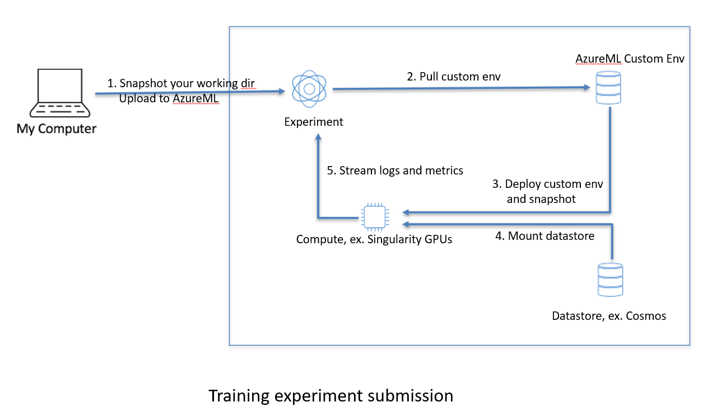
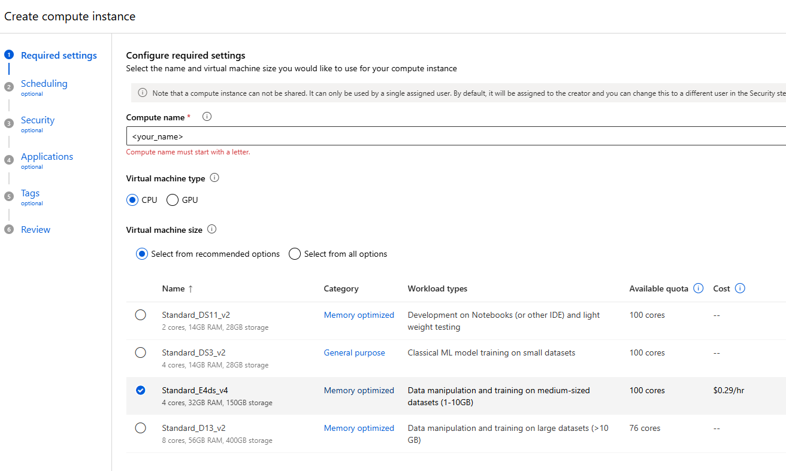

# Azure Machine Learning Onboarding (AzureML Python SDK)

This README helps you get productive in **Azure Machine Learning (AzureML)** using the **Python SDK**: authenticate, connect to a workspace, prepare data/environments, submit jobs, and debug common issues.

---

## 0) Why AzureML Python SDK (Benefits)
* Version Control by default: code, env, inputs are captured at submission time by immutable job snapshots
* Environment: built once, reused everywhere (Save GPU time)
* MLflow integration with near-zero effort: metrics, artifacts will still exist after your experiment finishes (only a few lines of code needed)
* AzureML Python SDK provides first-class, natively supported capabilities across the enture ML lifecycle.

---

## 1) Workflow


---

## 2) What you’ll need (Prerequisites)
- Request access to our experimental workspace: **pme-msan-cross-tenant-menghaoyang**
  - Message menghaoyang to get access for now
  - TODO: create a group to manage access in the future
- Create your own compute instance

- Connect to your compute instance via VSCode: this is done on your SAW machine
  - Install VSCode from Software Center
  - New VSCode on SAW machine no longer supports extensions marketplace, here is the announcement: https://engage.cloud.microsoft/main/articles/eyJfdHlwZSI6IlRocmVhZCIsImlkIjoiMzU1MTQxODY2NDU2Njc4NCJ9?search=saw%20machine%20vscode%20extension
  - You would need to install extensions from local VSIX files, VSIX files could be downloaded via announcement above or a copy on cosmos: https://www.cosmos08.osdinfra.net/cosmos/bingads.algo.prod.networkprotection/local/users/menghao/VSCODE/

---

## 3) Continue with the [Getting Started tutorial](./getting-started/train-singularity-pme.ipynb)

This python notebook introduce the ml_client authentication, env creation, and experiment submission.

--- 

## 4) Trouble-shootings

Q. `DefaultCredential` authentication fails on SAW machine while setting up the authentication for job submission. The error message reads below:
```
ManagedIdentityCredential: Azure ML managed identity configuration not found in environment. invalid_scope
SharedTokenCacheCredential: SharedTokenCacheCredential authentication unavailable. No accounts were found in the cache.  
```
A: The problem is about `identity-based` auth not setup correctly. Refer to the [comment](https://github.com/Azure/azure-cli/issues/24675#issuecomment-1613446235) here, which involves copying settings for `identity-based` auth to environment variable.
